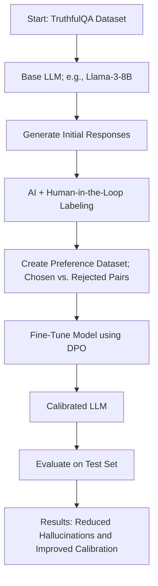

# Project Calibrate-LLM: A PoC on Training for Trustworthy AI

### Overview

Large Language Models (LLMs), despite their capabilities, often "hallucinate"—producing plausible but incorrect statements with high confidence. This project argues that this is not just a model failure, but a failure of the training and evaluation paradigm. Current benchmarks often use a binary scoring system that rewards guessing and penalizes uncertainty, optimizing models to be "good test-takers" rather than honest and reliable agents. [(Source)](https://cdn.openai.com/pdf/d04913be-3f6f-4d2b-b283-ff432ef4aaa5/why-language-models-hallucinate.pdf).

This Proof of Concept (PoC) explores an alternative approach inspired by professional certification exams (like the PMP Study Hall), where self-awareness of one's knowledge is as important as correctness. We aim to fine-tune an LLM not just to be correct, but to be **well-calibrated**—to express high confidence only when it is correct, and to appropriately express uncertainty or abstain when it is not. The PoC derives inspiration from recent OpenAI's work available [here](https://cdn.openai.com/pdf/d04913be-3f6f-4d2b-b283-ff432ef4aaa5/why-language-models-hallucinate.pdf).

### Project Goals

1.  **Implement a Preference-Based Training Scheme:** Fine-tune an open-source LLM using Direct Preference Optimization (DPO) to teach it calibrated confidence.
2.  **Develop a "Calibrated" Model:** The final model should learn to output a self-assessed confidence level (`[HIGH]`, `[MEDIUM]`, `[LOW]`) or an "I don't know" response.
3.  **Reduce Hallucinations:** Quantitatively measure a reduction in "confidently incorrect" answers on a challenging benchmark like `TruthfulQA`.
4.  **Promote Honesty:** Demonstrate that the model learns to prefer abstaining ("I don't know") over making a low-confidence, incorrect guess.

### Methodology

Our approach is a **human-in-the-loop, preference-tuning workflow**. We will create a high-quality dataset of preference pairs to teach the model the desired behaviors based on the following logic:

| If the Base Model's Output is... | Our Action is to...                                                   |
| -------------------------------- | --------------------------------------------------------------------- |
| 🔴 **High Confidence, Incorrect** | Heavily penalize by marking it as the `rejected` response.            |
| 🟡 **Low Confidence, Incorrect** | Mark as `rejected`; provide `"I don't know"` as the `chosen` response. |
| 🔵 **Low Confidence, Correct** | Mark as `rejected`; provide the same answer with `High Confidence` as `chosen`. |
| 🟢 **High Confidence, Correct** | Reinforce by marking as a `chosen` response.                          |

### Workflow Diagram

### Tech Stack

- Models: Llama-3-8B-Instruct (or similar)
- Datasets: TruthfulQA
- Frameworks: PyTorch
- Libraries: Hugging Face transformers, datasets, trl (for DPO)

### Getting Started

Refer to Google Colab notebook [here](https://colab.research.google.com/drive/1jm_4NA7mYqPucRusMnJhJ8VpEMu6wq4e?usp=sharing)
